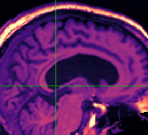

Ecog GUI
========

Ecog GUI is a Python module to localize intracranial electrodes from MRI.

It interactively fits a priori known electrodes to the MRI with a Graphical
User Interface.

This is currently an alpha version.



Example
=======
[To use the interface](examples/gui_mri_ecog):

```
from ecoggui import ElectrodeGUI
cd examples
ElectrodeGUI('T1_post_deface.nii.gz')
```

To understand what is happening:
* [`examples/model_displacement.py`](examples/model_displacement.py) how the 2D grid/strips are fitted with a
rotation and translation to math the 3D locations.
* [`examples/model_surface.py`](examples/model_surface.py): how the 2D grid/strips are fitted with a
2nd order polynomial with a constrain on the electrodes local distances, as we
know the grid can be flexible but are not elastic.

Installation
============

Clone this repository and install using setup.py:

```python setup.py develop --user```


Dependencies
============

The required dependencies to use the software are:

* Python >= 2.7
* setuptools
* Numpy >= 1.6.1
* SciPy >= 0.9
* Scikit-learn >= 0.17
* Nibabel >= 1.1.0
* Matplotlib >= 1.5.1
